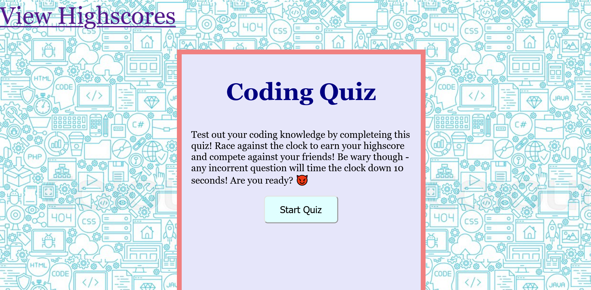

# Coding-Quiz
This is a timed coding quiz with multiple-choice questions to test the knowledge pf potential web-developers with a few questions. This app will run in the browser and will feature dynamically updated HTML and CSS powered by JavaScript code, utilizing web APIS, local storage, and event listeners for the buttons to be useable. There was also an implementation of sub-pages for the user to be able to view the previously inputed highscores and initals.

## Code Implementations
* The code was built utilizing HTML, CSS, and Javascript in order to create the web app
  * Two htmls pages were created -- the main landing page, in which the user can start the timed quiz and answer through the questions that come up. The second html page displays all the collected highscores that were saved into the local storage
  * Two javascript files were created - the first is the main script, which has an object created
  for the use of all the questions, options, and answers, and also includes the entire javascript code for the application. The second script file contains the event listeners for adding up the complete final socres and continuing on to the highscore page.
  * The CSS style sheets includes the background image for the web app, as well as all the styling
  chooses for the text, the quiz "box, and the buttons colors.

## Link to the Code Quiz
Want to test out your coding knowledge? Follow the link to take the quiz!

https://dianavarce.github.io/Coding-Quiz/

## Code-Quiz Preview

